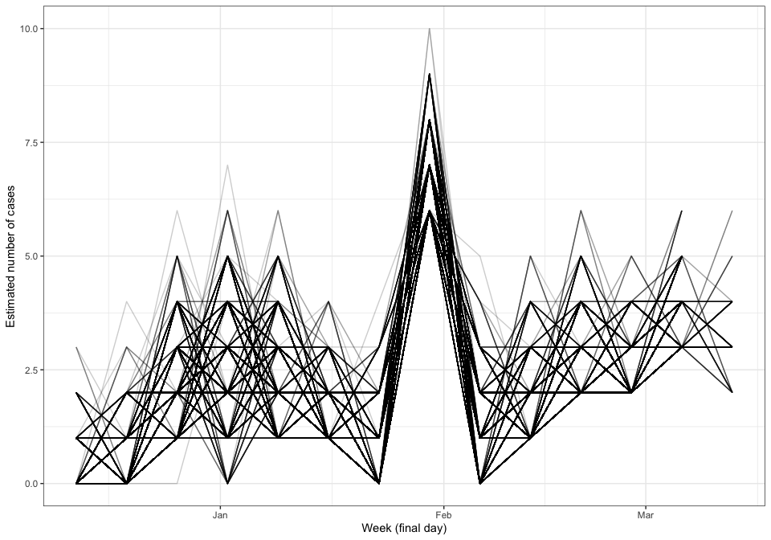

Estimating epidemiological parameters of Marburg disease in Equatorial
Guinea
================
Sebastian Funk
31 March, 2023

# Summary

Initial exploration of serial intervals and distribution from onset to
death for Marburg disease in Equatorial Guinea, using data from a
[published
report](https://www.guineasalud.org/archivos/Ordenes/Comunicado3.pdf).

# Model description

We estimate times of onset and death for all 31 reported cases. We
further estimate the parameters of the onset-to-death distribution, and
the serial interval from 14 established transmission pairs.

We modelled serial intervals as strictly non-negative and drawn from a
gamma distribution with parameters estimated from the data. We modelled
the onset-to-death distribution as drawn from a lognormal distribution
with parameters estimated from the data. In obtaining the parameters we
accounted for daily censoring and truncation at the end of the
observation period.

# Parameters of estimated distributions

**These results have been derived without a full understanding of the
data collection process and therefore need to be treated with caution.**

| Parameter                                      | Estimate                 |
|:-----------------------------------------------|:-------------------------|
| Serial interval (mean)                         | 10 days (95% CI: 9 – 12) |
| Serial interval (standard deviation)           | 5 days (95% CI: 4 – 6)   |
| Delay from onset to death (median)             | 6 days (95% CI: 4 – 8)   |
| Delay from onset to death (standard deviation) | 9 days (95% CI: 4 – 18)  |

# Estimated curve of symptom onsets

<!-- -->
